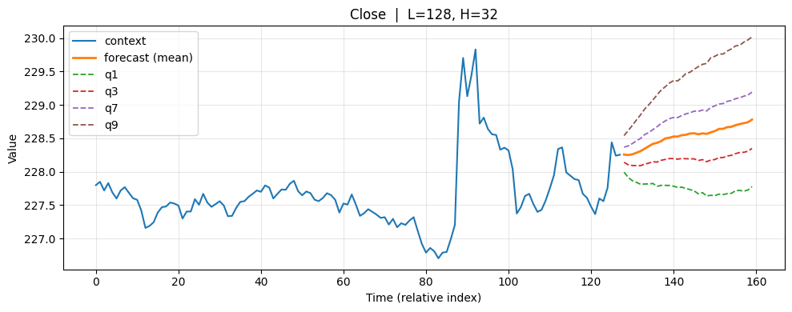
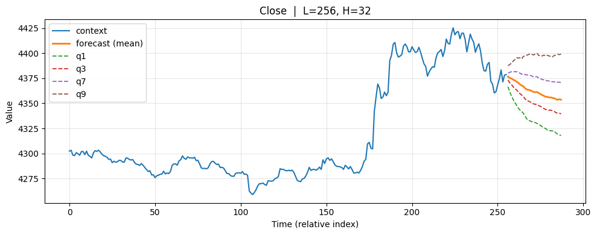

# FinCast: A Foundation Model for Financial Time-Series Forecasting

This repository contains the official implementation of **FinCast**, introduced in our paper:

> **FinCast: A Foundation Model for Financial Time-Series Forecasting**  
> Zhuohang Zhu, Haodong Chen, Qiang Qu, Vera Chung  
> *CIKM 2025* (Accepted)  
> Arxiv link: https://arxiv.org/abs/2508.19609

FinCast is a **decoder-only transformer** trained on over **20B financial time points** across diverse domains and temporal resolutions.  
Technical Highlights:
- **PQ-Loss**: Joint point + probabilistic forecasting.
- **Mixture-of-Experts (MoE)**: Specialization across domains.

---

## 🔥 Features
- Foundation model for **financial time-series forecasting**, flexible input and output length.
- Strong performance in **zero-shot**, **supervised**, and **few-shot** settings.
- Modular architecture with **MoE** and **quantile-aware loss**.
- Scalable to **1 billion of parameters** with efficient inference.

---

## 📦 Installation

- The model weight can be found on 🤗 https://huggingface.co/Vincent05R/FinCast
- The model code can be found on https://github.com/vincent05r/FinCast-fts
- The corresponding datasets to reproduce the results can be found on https://huggingface.co/datasets/Vincent05R/FinCast-Paper-test

Run the env_setup.sh first then run the dep_install.sh. We use conda as the venv management.

## 📊 Experiments

- run the corresponding scripts in the scripts directory to reproduce the results in the paper. The result summary can be generate using the result summary notebook in the notebook directory.

## 📈 Inference

FinCast supports **training-free inference** — simply download a checkpoint and start forecasting.  

✨ **Key Inference Features**  
- ⚡ **Plug-and-Play**: *No training required*. Just load a checkpoint and run inference.  
- 📏 **Flexible Context & Horizon**: Choose **any input length** and **any forecast length**.  
- 🔥 **Flexible time frequency and asset types!**: Choose **any frequency** and **any financial assets** such as stock, crypto, futures, forex.  
- 🎲 **Probabilistic Forecasting**: Native **quantile outputs** for uncertainty & risk analysis.  
- 🎯 **High Accuracy**: State-of-the-art performance across **financial benchmarks**.  

📘 See the **Inference Notebook** for quick start examples.  

Example 1 Apple stock minute data:

---

Example 2 Ethereum minute data:

## 🙌 Credits

- This repository draws inspiration from [TimesFM (Google Research)](https://github.com/google-research/timesfm), as well as [ST-MoE - Pytorch](https://github.com/lucidrains/st-moe-pytorch).  

## ⚡ Future Updates

- PEFT finetune(LORA/DORA) is done, just need to do some testing  
- Covariate Inference(currently implemented the same code as timesfm)  

## ⚠️ Disclaimer

This repository and the FinCast model are provided **for research and educational purposes only**.  
We make **no guarantees** regarding the accuracy, reliability, or suitability of the forecasts for financial decision-making.  

- This software does **not constitute financial advice**.  
- The authors and contributors **are not responsible** for any financial losses, damages, or other consequences arising from the use of this model or its outputs.  
- Users should evaluate and use the model **at their own risk**.  
